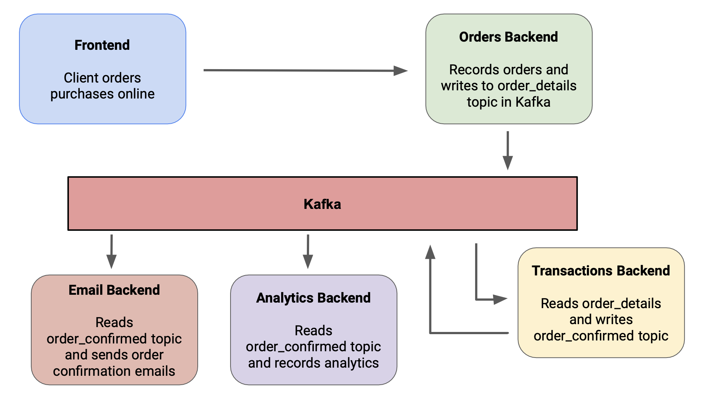

# Ordering System using Apache Kafka

This project is an Ordering System built using Apache Kafka, a distributed streaming platform. It allows for real-time order processing and communication between different components of the system.

## Attribution

This project was made possible with the help of the following:

- [Confluent Kafka](https://www.confluent.io/): A fully managed Kafka service that provides a reliable and scalable platform for building real-time data pipelines and streaming applications.
- [ChatGPT](https://github.com/openai/chatgpt): A language model developed by OpenAI for generating human-like text.

## Features

This project simulates orders using four backends that communicate with Kafka topics:

- `orders_backend`: Handles order creation, modification, and cancellation.
- `transactions_backend`: Manages payment transactions and updates order status.
- `analytics_backend`: Collects and analyzes data for generating insights and reports.
- `email_backend`: Sends email notifications to customers regarding order updates.

These backends leverage Apache Kafka's distributed streaming platform to enable real-time communication and processing between the different components of the Ordering System.
